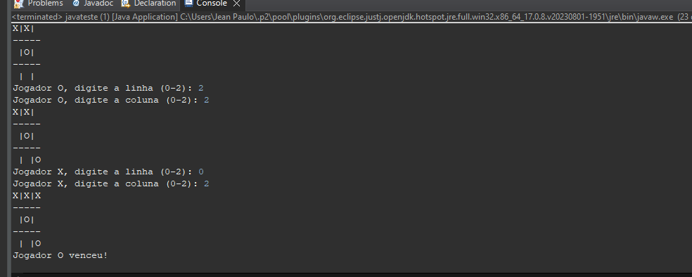
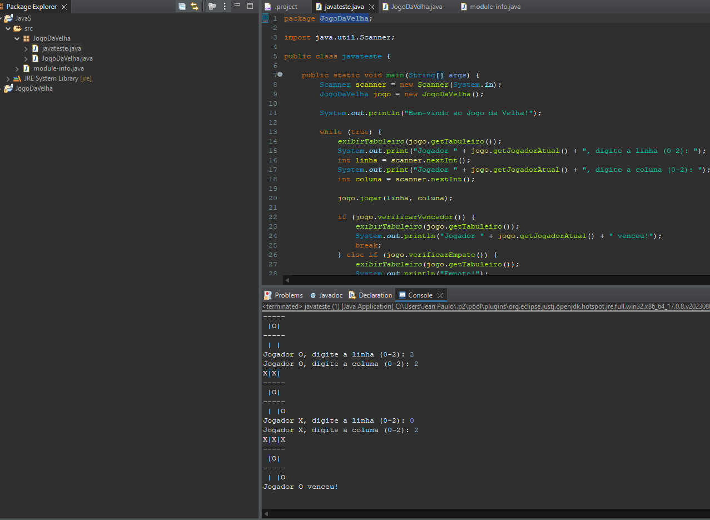

# JogoDaVelhaJava
Programa Entra21

Arrays
https://www.w3schools.com/java/java_arrays.asp
https://www.w3schools.com/java/java_arrays_loop.asp
https://www.w3schools.com/java/java_arrays_multi.asp 

Laço de repetição do for
https://www.w3schools.com/java/java_for_loop.asp

Exercícios
1) Criar o jogo da velha.

 

